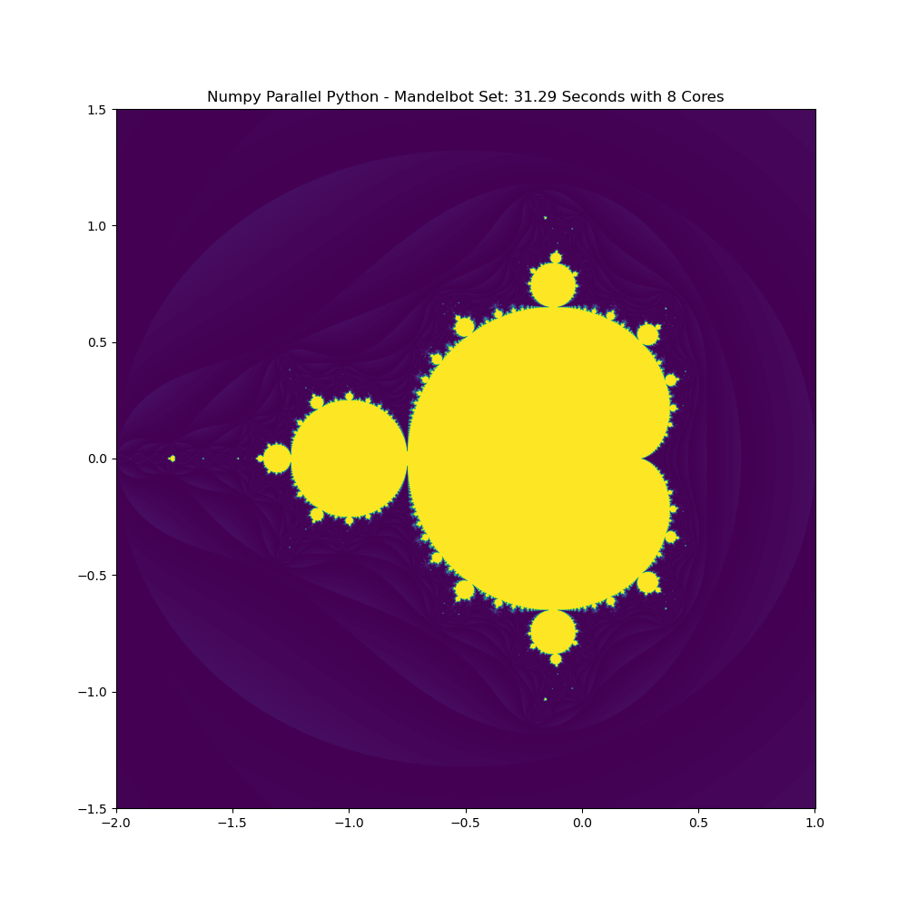

# Numerical Scientific Computing - Mandelbrot

This is the Readme for the Mini Project of the VGIS8 course NCS. The code was developed using python 3.8 on an ARM MacBook.

The following is the sample output of the programs. It has turned out to be particularly helpful to write the runtime in the plot title as well as in the file name. The colormap "viridis" shows local contrast differences relatively well, even in the lower or upper area, because it does not burn out as others do.

<figure>
    
</figure>

## Installation

Unpack the folder and install anaconda if not done before.

## Naive Python (62 Seconds)

```python
python3 naiv_python/naiv.py
```

### Matrix Creation: 4.04s, Calculation: 61.78s A
s it was to be expected, the naive Python version takes a very long time. Also the preparation of the matrix is very time consuming. The iteration over the large data structures is particularly time-consuming and generates a very large overhead.


## Numpy Vectorized / Numba (56 / 5 Seconds)

```python
python3 naiv_python/naiv.py
```

### Matrix Creation 0.05s, Calculation 55.68s 
The use of predefined functions to generate the output matrix is a significant improvement. The reason for this is the very efficient Numpy backend programmed in C, which is optimized as best as possible.

However, vectorization does not bring a particularly decisive advantage. It seems that the overhead is still very high due to the very simple calculation.

## Mumba Optimized

### Matrix Creation 0.05s, Calculation 5.26s 
With only one line of code, the runtime can be improved by a factor of 10 using numba. Numba only needs to be applied to the element wise calculation function, as this costs almost the entire runtime. It must be emphasized, however, that numba is disadvantageous in the interaction with numpy vectorization. A naive numpy implementation is about twice as fast as a numpy vectorized one, since numba cannot be applied to vectorized numpy code.

## Cython (37 Seconds)

```python
python3 cython/python3 install_cython.py build_ext --inplace
python3 cython/cython.py
```

### Matrix Creation 1.34s, Calculation 36.61s 
It is particularly interesting that naively implemented Cython code is significantly slower, both as pure numpy code and as numba optimized code. The difference is particularly large when creating the matrix. Here the advanced optimizations of numpy show up very clearly, which are very difficult to beat by own implementations. The calculation of the matrix is also considerably slower, which is particularly interesting. It seems like numpy could potentially have a big advantage with numba, even over native C code. This may be due to the automatic SIMD optimizations (ARM Neon / Intel AVX). In addition, the resources must also be used
more efficiently, since it alone cannot explain the difference. This is an exceptionally helpful result for future implementations, as it makes it clear that it is not necessary to write C code, but automatically optimized python code can even be faster in case of doubt.

## Multi-Core (5 Seconds)

```python
python3 multicore/multicore.py
```
The multicore results are also particularly exciting. As a starting point, the Numba optimized numpy code was used and multithreaded using the python multiprocessor pools and the map function. It is clearly visible that the runtime almost does not change. This indicates a memory bound. The CPU is probably too fast for the memory, so that it cannot be supplied with data fast enough. A wider memory interface would help here. This is a classic example of why memory bandwidth plays such an essential role in scientific computing.

## Dask (N/A Seconds)

```python
python3 dask/dask.py
```
Dask's test shows very clearly the reasonable limit of parallelization. The output matrix of 5000*5000 cannot be calculated in normal time, because the introduced overhead is so large. Already a 50*50 matrix needs longer than the others. Due to the time complexity of the problem of O(n2 ), a calculation with full size is no longer reasonable. Distributed computing makes no special sense with a trivial formula like the Mandelbrot, it only increases the complexity and takes longer. This approach is only worthwhile for highly complex problems, where the computation time is less than the overhead. For example, large simulations.

## OpenCL (N/A Seconds)

! Kernel is available but could not be tested due to no support of OpenCL !

Not possible to test due to lack of software support. The current generation of MacBooks does not support OpenCL at all, neither on the CPU nor on the GPU. Also, the alternative way by using the AAU AI Cloud GPU Cluster (DGX-2, Nvidia Tesla V100) proved not possible due to missing permissions for low-level hardware access. For this reason, the runtime cannot be determined. However, the OpenCL kernel is included with the project. A great runtime improvement is to be expected, since this problem fits perfectly to the GPU. A very large number of parallelized computations is the specialty of GPUs.

## License
[MIT](https://choosealicense.com/licenses/mit/)